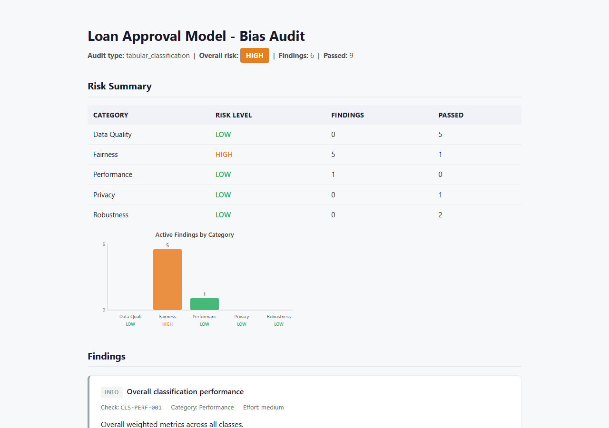
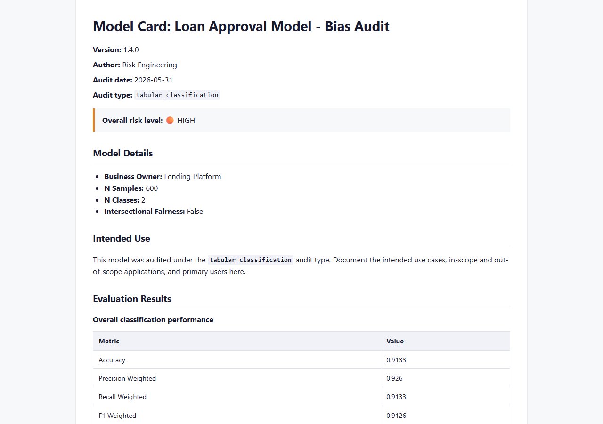
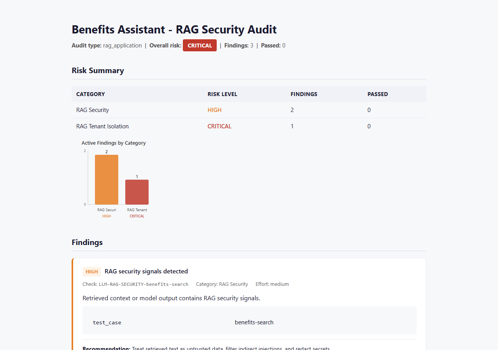
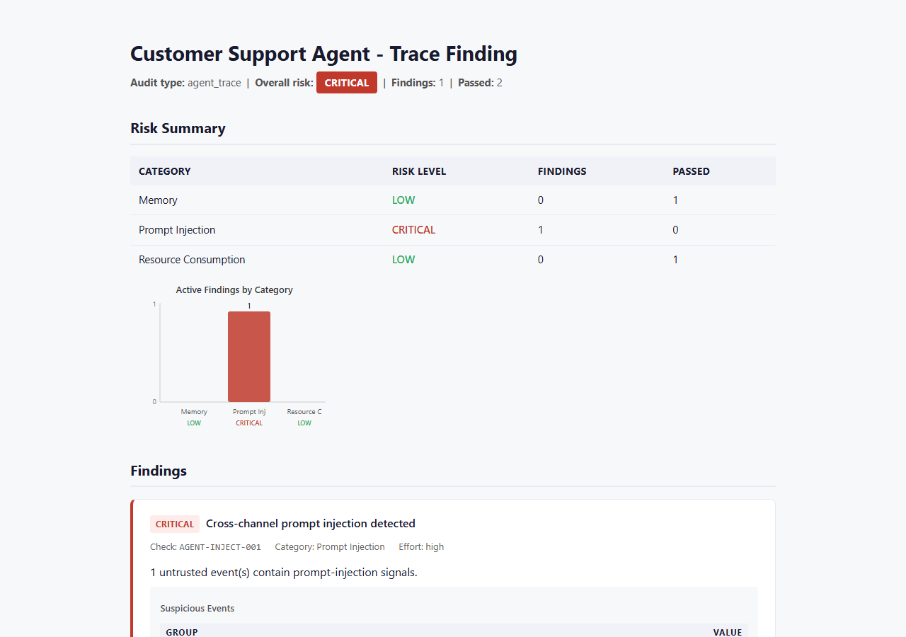

# RAI Audit Kit

**RAI** = **Responsible AI**. A Python package suite for evidence-grade audits of
responsible, secure, and trustworthy AI systems.

Run fairness, data quality, robustness, compliance, image, medical imaging, LLM
safety, RAG security, and agent trace checks. Export HTML, Markdown, or JSON
reports and gate CI pipelines on risk thresholds.

**Author:** Sai Teja Erukude | **License:** MIT

## Why this exists

AI teams often run fairness, robustness, RAG, and agent security checks separately.
RAI Audit Kit brings them into one evidence and reporting workflow, so teams can
review findings consistently, preserve audit artifacts, and apply the same CI gates
across model types.

## What it looks like

<table>
  <tr>
    <td><strong>HTML audit report</strong><br>
      <a href="docs/images/html-report.png">
        
      </a>
    </td>
    <td><strong>Model card export</strong><br>
      <a href="docs/images/model-card.png">
        
      </a>
    </td>
  </tr>
  <tr>
    <td><strong>LLM and RAG audit output</strong><br>
      <a href="docs/images/rag-audit.png">
        
      </a>
    </td>
    <td><strong>Agent trace finding</strong><br>
      <a href="docs/images/agent-trace-finding.png">
        
      </a>
    </td>
  </tr>
</table>

## Install

```bash
pip install rai-audit-kit          # core + tabular ML
pip install "rai-audit-kit[all]"   # all modules (dl, llm, agents)
```

## Quick start

```bash
rai-audit ml run --help
```

For repeatable audit workflows, generate and run a YAML configuration:

```bash
rai-audit init --project loan-model
rai-audit run --config audit.yaml
```

Configured runs write report artifacts and an evidence manifest with input,
environment, source-revision, and artifact hashes.

```python
from rai_audit.ml import ClassificationAudit

report = ClassificationAudit(
    y_true=y_true,
    y_pred=y_pred,
    sensitive_features=sensitive_df,
).run()

report.to_html("audit_report.html")
```

## Examples

- [Fairness audit walkthrough](packages/rai-audit-ml/examples/ml_fairness_audit/example.py)
- [Batch drift monitoring](packages/rai-audit-ml/examples/ml_drift_monitoring/batch_monitor.py)
- [MLflow and Airflow templates](packages/rai-audit-ml/examples/mlops_integrations/)
- [Captured-response LLM and RAG audit suite](packages/rai-audit-llm/examples/llm_audit_suite.yml)
- [Scientific image robustness audit](packages/rai-audit-dl/examples/scientific_ai/microscopy_audit.py)
- [Agent trace with a webpage prompt-injection attempt](packages/rai-audit-agents/examples/customer_support_trace.json)

## Packages

| Package | Purpose |
|---------|---------|
| `rai-audit-core` | Audit engine, findings, reports, history, CI gates |
| `rai-audit-ml` | Tabular ML - fairness, drift, data quality, robustness |
| `rai-audit-dl` | Image, medical imaging, and scientific AI audits |
| `rai-audit-llm` | LLM and RAG safety, faithfulness, citation, and security audits |
| `rai-audit-agents` | Agent tool-use, memory, permission, and injection audits |
| `rai-audit-kit` | Meta-package - installs core + ml, unified CLI |

## Development

```bash
pip install uv
uv sync
uv run pytest
```

See [CONTRIBUTING.md](https://github.com/SaiTeja-Erukude/rai-audit/blob/main/CONTRIBUTING.md)
for monorepo layout and release workflow.
